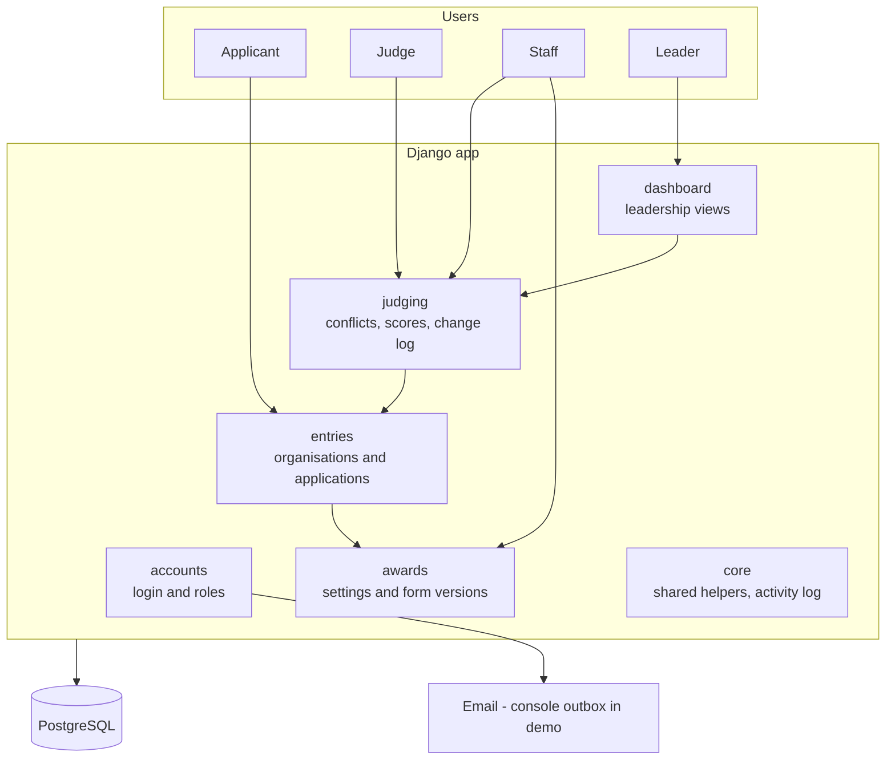

# Architecture and Project Structure

> **Status: Draft.** This will change as the build progresses. Changes are tracked in git history.

## The project in one line

**Project:** one web platform that runs many award programmes. Staff set up each award (rounds, blind judging, form questions) on screen, without code.
**Type:** server-rendered web app
**Stack:** Django (Python) + PostgreSQL
**Scale:** solo / small team, demo first, built so it can grow
**Key features:** login and roles, award settings, versioned forms, applications, conflict-free judge assignment, blind scoring, score change log, leadership dashboard

---

## 1. Directory tree

```text
AwardApplication/
├── README.md                 # How to run the project (start here)
├── .env.example              # Template for local settings; copy to .env
├── .gitignore                # Files git must never track (.env, caches, db)
├── .dockerignore             # Files Docker should not copy into the image
├── requirements.txt          # Python packages the app needs
├── requirements-dev.txt      # Extra packages for tests
├── pytest.ini                # Test settings
├── manage.py                 # Django command line (runserver, migrate, ...)
├── Dockerfile                # How to build the app container
├── docker-compose.yml        # Runs the app + PostgreSQL locally with one command
│
├── .github/
│   └── workflows/ci.yml      # Runs the tests on GitHub for every push
│
├── config/                   # Project-wide settings (not per-award)
│   ├── settings.py           # Reads secrets and database from environment
│   ├── urls.py               # Top-level URL routes
│   ├── wsgi.py / asgi.py     # Entry points for web servers
│
├── apps/                     # The application, split by business area
│   ├── core/                 # Shared helpers: base models, activity log, seed data
│   │   └── management/commands/seed_demo.py   # Loads fake demo data
│   ├── accounts/             # Users, roles, magic-link login
│   ├── awards/               # Award, cycle, settings, form versions, criteria  [R1, R4]
│   ├── entries/              # Organisations, applications, duplicates, files   [R4]
│   ├── judging/              # Judges, conflicts, assignments, scores, changes  [R1, R2, R3]
│   └── dashboard/            # Leadership views (reads from the other apps)
│
├── templates/                # Shared page layouts (base.html) and pages
├── static/                   # CSS, images, JavaScript
│
├── tests/
│   ├── test_smoke.py         # App starts, home page loads
│   └── rules/                # One test file per rule from the brief
│       ├── test_rule1_blind_judging.py
│       ├── test_rule2_conflict_of_interest.py
│       ├── test_rule3_score_audit.py
│       └── test_rule4_form_versions.py
│
└── docs/                     # Everything that isn't code
    ├── README.md             # Index of all documents
    ├── Architecture.md       # This file
    ├── Roadmap.md            # Product roadmap
    ├── User-Workflows.md     # Journey of each user
    ├── testing.md            # What the tests check, and what they don't
    ├── Git-Workflow.md       # Branches and commits
    ├── decisions/            # Decision log (options, choice, why)
    ├── reports/              # Daily progress reports
    └── meetings/             # Meeting notes with the reviewer
```

Each app inside `apps/` follows standard Django layout: `models.py` (data), `views.py` (pages), `urls.py`, `admin.py`, `migrations/`, and later `forms.py`, `services.py` and `templates/<app>/`.

---

## 2. Why it's organised this way

**One Django project, split into apps by business area.** Each app matches a part of the user workflows: awards (staff setup), entries (applicants), judging (judges), dashboard (leadership). When something breaks in judging, you look in `apps/judging/`.

**Rules live where the data lives.** Each of the 4 rules is enforced in the app that owns that data, and tested in `tests/rules/`. The reviewer can open one folder and see every rule tested.

**Main trade-offs**

| We chose | Instead of | Why | What we give up |
|---|---|---|---|
| One app (modular monolith) | Separate frontend + backend, or microservices | One thing to build, run and deploy. Right size for a small team | Harder to scale parts separately (not needed now) |
| Server-rendered pages (Django templates) | React single-page app | Half the code; Django gives forms, login and admin for free | Less interactive screens; can add small JavaScript where needed |
| Form questions stored as JSON in `FormVersion` | A database column per question | Staff can change questions without a developer or a migration | Harder to run reports on individual answers |
| PostgreSQL | MySQL, SQLite | Strong JSON support and reliable for production | Needs a database server (Docker makes this easy) |
| Shared database, every record tied to an award cycle | One database per award | Simple; leadership can see all awards in one query | Must always filter by award (enforced in code and tests) |

---

## 3. Where things live

| What | Where | Notes |
|---|---|---|
| **Project config** | `config/settings.py` | Same for every award |
| **Per-award settings** | Database: `AwardCycle` and `FormVersion` (in `apps/awards`) | Staff edit these on screen. **This is how two awards differ without code.** |
| **Environment variables** | `.env` (local, never committed); template in `.env.example` | Secrets, database URL, debug flag |
| **Tests** | `tests/rules/` for the 4 rules, `tests/` for whole-app checks, `apps/<app>/tests/` for unit tests of one app | Run all with `pytest` |
| **Docs** | `docs/` | Plans, decisions, reports, meetings |
| **Shared utilities** | `apps/core/` | Base models, activity log, helpers used by several apps |
| **Templates** | `templates/` for shared layouts; `apps/<app>/templates/<app>/` for app pages | Standard Django convention |
| **Demo data** | `apps/core/management/commands/seed_demo.py` | Fake data only: never real PAN/GST |

### How one award's data stays apart from another's

- Every application, assignment and score belongs to one `AwardCycle`.
- Staff are linked to specific awards through `AwardStaff`. Pages only show awards the user is linked to.
- Leaders see all awards (read and approve only).
- Tests check that staff of Award A cannot open Award B's data.

---

## 4. How the parts fit together



---

## 5. Frameworks considered

| Option | Verdict | Reason |
|---|---|---|
| **Django + PostgreSQL** | ✅ Chosen | Built-in login, admin, forms and migrations: the fastest way to a working demo |
| Spring Boot + PostgreSQL | Turned down | Works well in IntelliJ, but needs much more code for the same features |
| React + Node/Express + PostgreSQL | Turned down | Two apps to build and connect; too much for the time available |
| Laravel (PHP) | Not considered further | Similar to Django, but the team prefers Python |

**What would change our mind:** if the client needs a mobile app or very interactive screens, we would add a React frontend that talks to a Django REST API (the models and rules stay the same).

---

## 6. How the structure grows

| When | Change |
|---|---|
| An app's `views.py` gets long | Split into `views/` folder; move business logic into `services.py` |
| Other systems need data | Add Django REST Framework and an `api/` module per app |
| Slow work (emails, PDF reports) | Add a background worker (Celery or Django-Q) and a `tasks.py` per app |
| Production launch | Split settings into `config/settings/base.py`, `dev.py`, `prod.py`; serve with Gunicorn behind Nginx |
| Many awards and heavy load | Add caching (Redis) and database indexes on award and cycle |
| A new kind of competition (e.g. on-site 5S audit) | New app (e.g. `apps/audits/`), not changes to every existing app |

**Rule of thumb:** don't add a folder or tool until a real problem needs it.
