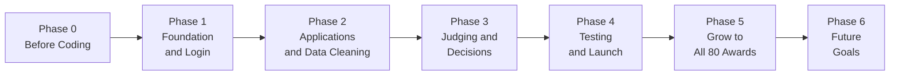

# Product Roadmap: Awards Platform

> **Status: Draft (in research)**
> This roadmap reflects our current understanding of the requirements. We are still researching the domain and confirming details with the client. Phases, scope and priorities may change as we learn more. Every change will be recorded in this file's commit history and shared with the reviewer.

**Goal:** one platform that runs all 80 award programmes. Applicants, judges, staff and leadership all use the same system, and staff can set up a new award without a developer.

---

## The road at a glance

### How this matches the Software Development Life Cycle (SDLC)

| SDLC stage | Where it happens in this roadmap |
|---|---|
| 1. Planning | Phase 0 |
| 2. Requirements | Phase 0 |
| 3. Design | Phase 0 |
| 4. Development (coding) | Phases 1, 2, 3 |
| 5. Testing | Phase 4 (plus small tests in every phase) |
| 6. Deployment (launch) | Phase 4 |
| 7. Maintenance | Phase 5 |
| Repeat the cycle | Phase 6: each future goal goes through the same steps again (plan, design, build, test, launch) |

---

## Phase 0: Before Coding (Planning, Requirements, Design)

*Know exactly what to build and how, before writing any code.*

### Stage 1: Planning — *What problem are we solving?*

| # | Step | What it produces | Status |
|---|---|---|---|
| 1 | Understand the problem: read the brief and research similar bodies (e.g. CII) | Problem summary | ✅ Done |
| 2 | Talk to the client: meetings to clear up doubts | Meeting notes | ✅ Done |
| 3 | List assumptions: what we guess when the client hasn't told us (number of applications, past data) | Assumptions list | ✅ Done |
| 4 | Agree on scope: what's in, what's out, and why | In/out list | ⬜ To do |
| 5 | List the risks: what could go wrong and how we handle it | Risk list | ⬜ To do |

### Stage 2: Requirements — *What must the system do?*

| # | Step | What it produces | Status |
|---|---|---|---|
| 6 | Define the users and roles: Leader, Member, Working staff, Judge, Applicant | Roles and permissions table | ✅ Done |
| 7 | Map each user's workflow, step by step | [User-Workflows.md](User-Workflows.md) | ✅ Done |
| 8 | Write the requirements: features as "must have" and "nice to have" | Requirements list | ⬜ To do |
| 9 | Write the business rules: the 4 rules, judge assignment rules, duplicate rules | Rules list | 🟡 Partly done |
| 10 | Handle exceptions: what happens when things go wrong (ties, late conflicts, lost access) | Exceptions table | ✅ Done |
| 11 | Decide what is the same for every award and what changes per award | "Shared vs. per-award" table | ⬜ To do |

### Stage 3: Design — *How will we build it?*

| # | Step | What it produces | Status |
|---|---|---|---|
| 12 | Draw the screens: simple sketches of each page | Screen sketches (wireframes) | ⬜ To do |
| 13 | Design the data: tables like Award, Form version, Application, Judge, Score, Score change log | Data model diagram | ⬜ To do |
| 14 | Draw the architecture: how the parts fit together, where award settings live, how awards' data stays separate | Architecture drawing | ⬜ To do |
| 15 | Choose the technology: language, framework, database, and the options we turned down | Tech decision notes | ⬜ To do |
| 16 | Plan the tests: one test for each rule, written before the code | Test plan | ⬜ To do |

### Stage 4: Get ready to code

| # | Step | What it produces | Status |
|---|---|---|---|
| 17 | Break the work into small tasks and order them | Task list (e.g. GitHub Issues) | ⬜ To do |
| 18 | Set up the project: repo folders, code skeleton, database, README | Running empty app | ⬜ To do |
| 19 | Create test data: fake companies, judges and two sample awards | Seed data | ⬜ To do |
| 20 | Get sign-off: the reviewer agrees with scope and design | Approval | ⬜ To do |

**Outcome:** we know what to build, how to build it, and how to check it works. Coding can start.

---

## Phase 1: Foundation and Login

*Build the base everything else stands on.*

- Users can log in (magic link by email).
- Five roles with their own access: Leader, Member, Working staff, Judge, Applicant.
- **Award settings screen:** staff create an award and choose rounds (1 or 2), blind on/off, number of judges and scoring questions.
- **Form builder:** staff build the application form without code. Every published form is saved as a version.
- An activity log records important actions from day one.

**Outcome:** staff can create two different awards on screen.

---

## Phase 2: Applications and Data Cleaning

*Let applicants apply, and keep the data clean.*

- Applicants register their organisation with a GST number.
- One entry per organisation per award. A second entry is stopped.
- Company names are cleaned ("Acme Ltd." and "ACME Limited" become one) and possible duplicates are sent to staff to check.
- Long forms auto-save, and applicants can come back later.
- Evidence files can be uploaded.
- Applicants can track their status.
- Staff can enter applications by hand for people who apply offline.
- Old applications always open in the form version they were sent with.

**Outcome:** applicants can submit, and every organisation appears only once.

---

## Phase 3: Judging and Decisions

*Score fairly and make the final call.*

- Staff select judges, and judges declare their conflicts.
- **Judge assignment:** the system never gives a judge an entry they have a conflict with. It also matches expertise and spreads the work evenly.
- Judges accept, decline or flag a conflict for each entry.
- **Blind judging** hides who applied, for awards that use it.
- Scores auto-save. After the final submit, any change needs a reason and is recorded.
- Final score = average of the judges' scores.
- 2-round awards get a shortlist and a live Round 2.
- **Leadership dashboard:** all awards in one view, plus a review queue for ties, big score gaps, conflicts and appeals.
- Leadership approves the winners, then results are published.

**Outcome:** one full award cycle runs from entry to winner.

---

## Phase 4: Testing and Launch

*Make sure it works and is safe before real people use it.*

- Test the 4 rules: blind judging, no conflicts, score changes recorded, old forms still open.
- Test the busy deadline day, when many applicants submit at once.
- Security checks for login, file uploads and private data.
- Email and SMS reminders go live.
- Train staff and write simple user guides.
- **Pilot:** run 2–3 real awards first.

**Outcome:** the platform is live for the pilot awards.

---

## Phase 5: Grow to All 80 Awards

*Move everything onto the platform, step by step.*

- Move the remaining awards over in batches.
- Bring in useful data from past years.
- Add entry fee payments for awards that charge.
- Support shop-floor competitions (Kaizen, 5S) that don't fit the usual form.
- Add reports and exports for leadership.
- Improve the platform based on feedback.

**Outcome:** all 80 awards run on one platform.

---

## Phase 6: Future Goals

*Once all 80 awards run smoothly, make the platform better for everyone.*

### Short term (soon after launch)

| Goal | Why it helps | Who benefits |
|---|---|---|
| WhatsApp and SMS updates | People see WhatsApp faster than email | Applicants, Judges |
| Hindi and regional languages | Regional and shop-floor teams can apply in their own language | Applicants |
| Mobile-friendly judging | Judges can score on a phone in short gaps | Judges |
| Certificates and scorecards as PDF | Winners get certificates instantly, and applicants get feedback | Applicants |
| Appeals inside the system | Disagreements are handled and recorded in one place | Applicants, Leadership |

### Medium term

| Goal | Why it helps | Who benefits |
|---|---|---|
| Real GST and PAN verification | Stops fake entries automatically, not just by format | Staff |
| Single sign-on with the member portal | One login for everything, fewer duplicate accounts | All users |
| Partner organisation access | Outside bodies that co-run awards can work in the platform | Partners, Staff |
| Year-on-year insights | See trends: how many apply, who improves, which awards grow | Leadership |
| Judge calibration tools | Judges compare scoring before a round so scores are more consistent | Judges, Staff |
| Award templates library | New awards start from a ready template, so setup takes minutes | Staff |

### Long term

| Goal | Why it helps | Who benefits |
|---|---|---|
| AI helper for judges | Summarises long applications and points out missing evidence. **Judges still give every score.** | Judges |
| AI helper for applicants | Checks the form for gaps before submitting | Applicants |
| On-site judging app (works offline) | Fits shop-floor audits like 5S, done on the factory floor | Judges |
| Public winners showcase | Winners get recognition, and more people hear about the awards | Applicants, Leadership |
| Offer the platform to other organisations | Other industry bodies can use it to run their own awards | Organisation |

**Outcome:** the platform keeps improving and becomes the standard way to run awards.

---

## Summary

| Phase | Focus | Main result |
|---|---|---|
| 0 | Before coding: plan, requirements, design | Clear plan, design and test plan |
| 1 | Foundation and login | Awards can be set up without code |
| 2 | Applications and data cleaning | Applicants submit; no duplicate organisations |
| 3 | Judging and decisions | Fair scoring and approved winners |
| 4 | Testing and launch | Live with pilot awards |
| 5 | Grow | All 80 awards on the platform |
| 6 | Future goals | A better platform for every user, and possibly other organisations |
