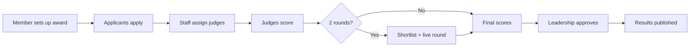

# User Workflows

This page shows what each person does in **one award cycle**, step by step.

We built for two awards that work differently:

| | Award A: Business Excellence | Award B: Kaizen |
|---|---|---|
| Form | Long | Short, with before/after photos |
| Rounds | 2 (scoring, then live presentation) | 1 |
| Blind judging | Yes (Round 1 only) | No |

Staff choose these settings on a screen. No code changes are needed.

The four rules from the brief are tagged like this:
**[R1]** Blind judging · **[R2]** No conflict of interest · **[R3]** Score changes are recorded · **[R4]** Old forms still open

---

## 1. Applicant

1. **Log in** with an email. Usually the organisation's email, but a personal email also works.
2. **Pick an award** and start the application.
3. **Enter the organisation's GST number.** This stops:
   - people pretending to be another company
   - the same company sending two entries
4. **If the company has already entered this award**, the system stops the new entry. The first entry is kept and the second is not allowed. If this is a mistake, the applicant contacts staff.
5. **Fill the form.** It saves automatically, so the applicant can stop and come back.
6. **Submit.** After this, the entry is locked.
7. **Track the status:** Submitted → Under review → Shortlisted / Not shortlisted → Result.
8. **Award A only:** if shortlisted, present live in Round 2.

The application always remembers which version of the form it used. **[R4]**

---

## 2. Judge

1. **Get selected first.** A Member or staff picks the judge for the award. Nobody can sign up as a judge alone.
2. **Log in with a magic link** sent to their email. No password is needed. One click opens their page.
3. **See their assigned entries.** For each one, the judge clicks:
   - **Accept** to score it
   - **Decline** to give it back
   - **Conflict** if they know the applicant. The entry is removed from them. **[R2]**
4. **Blind award:** the judge sees `Entry A-0042`, not the company name. **[R1]**
5. **Score each question.** The page shows a progress bar (for example, 60% done), and scores **save automatically**.
6. **Final submit.** After this the scorecard does not reopen. If a score must change, the judge has to give a reason, and the change is recorded. **[R3]**
7. **If a judge drops out**, their entries go back to the pool and get assigned to another judge.

---

## 3. Staff (Member and Working staff)

**Before the cycle (the Member)**
1. Create the award and choose its settings: rounds, blind on or off, number of judges, scoring questions.
2. Build the form. Publishing it saves it as a version, and old versions are never changed. **[R4]**
3. Select the judges.

**During the cycle (Working staff)**
1. Check new entries.
2. Help applicants who contact them, for example someone blocked by a duplicate GST.
3. **Assign judges.** The system suggests judges using the rules below, and staff confirm.
4. Send reminders to slow judges.
5. **Award A:** make the shortlist for Round 2.

### Judge assignment rules

| Priority | Rule |
|---|---|
| **1 (never broken)** | Never give a judge an entry they have a conflict with. **[R2]** |
| 2 | Match the judge's expertise to the award category. |
| 3 | Balance the load, so no judge gets far more entries than others. |
| 4 | Don't put the same group of judges together every time. |
| 5 | Cap the maximum entries per judge. |

---

## 4. Leadership

1. **Dashboard:** one view of all awards, showing scores, flagged items and pending decisions.
2. **Review queue:** problem cases sent up for a decision, such as ties, re-evaluation requests, conflict cases and applicant appeals.
3. **Policy settings:** set the rules that apply to all awards.
4. **Decisions:**
   - approve the winners
   - decide conflict cases
   - decide appeals (resolutions)

Leadership can approve or send back results, but cannot change scores.

---

## 5. When things go wrong (exceptions)

| Problem | What happens |
|---|---|
| **Applicant leaves a draft unfinished** | The system sends a reminder email before the deadline. |
| **Applicant wants to edit a submitted entry** | Not allowed, unless staff ask for more information. Then only that part opens. |
| **Applicant disagrees with the result** | They raise an appeal with a reason. Leadership reviews it and decides. |
| **Someone loses access to their account** | They get a new login link by email. If the email itself has changed, staff verify and update it. |
| **A conflict is found late** (after scoring started) | The entry is taken from that judge, their scores are removed (and recorded), and a new judge is assigned. **[R2] [R3]** |
| **Tie** | The tie goes to the Leadership review queue to decide. |
| **Big gap between judges' scores** (for example, 4+ points) | The entry is flagged. It can be re-scored or given one extra judge. |

---

## One cycle, start to end

